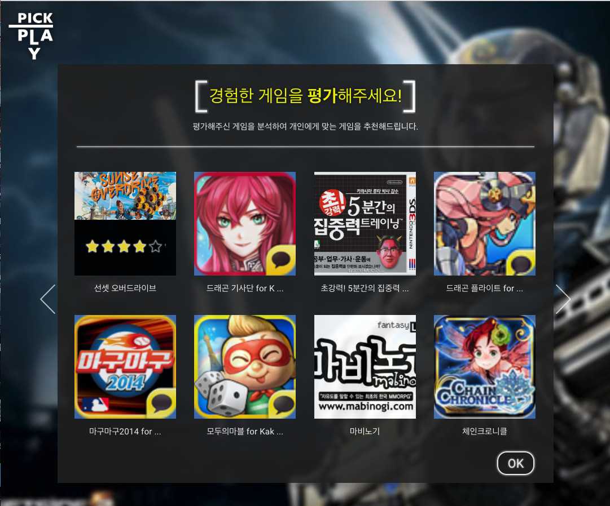
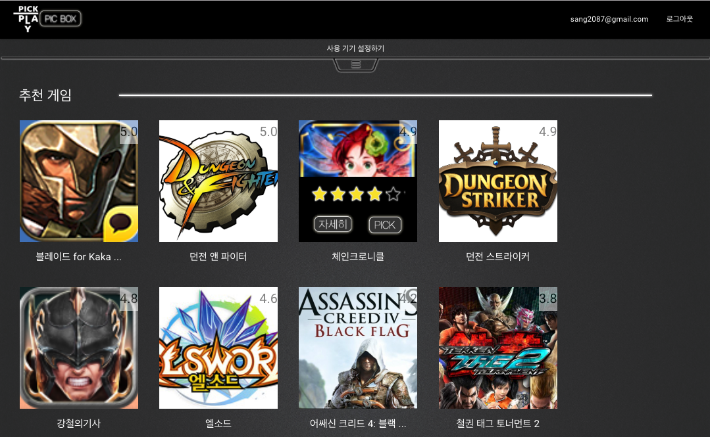
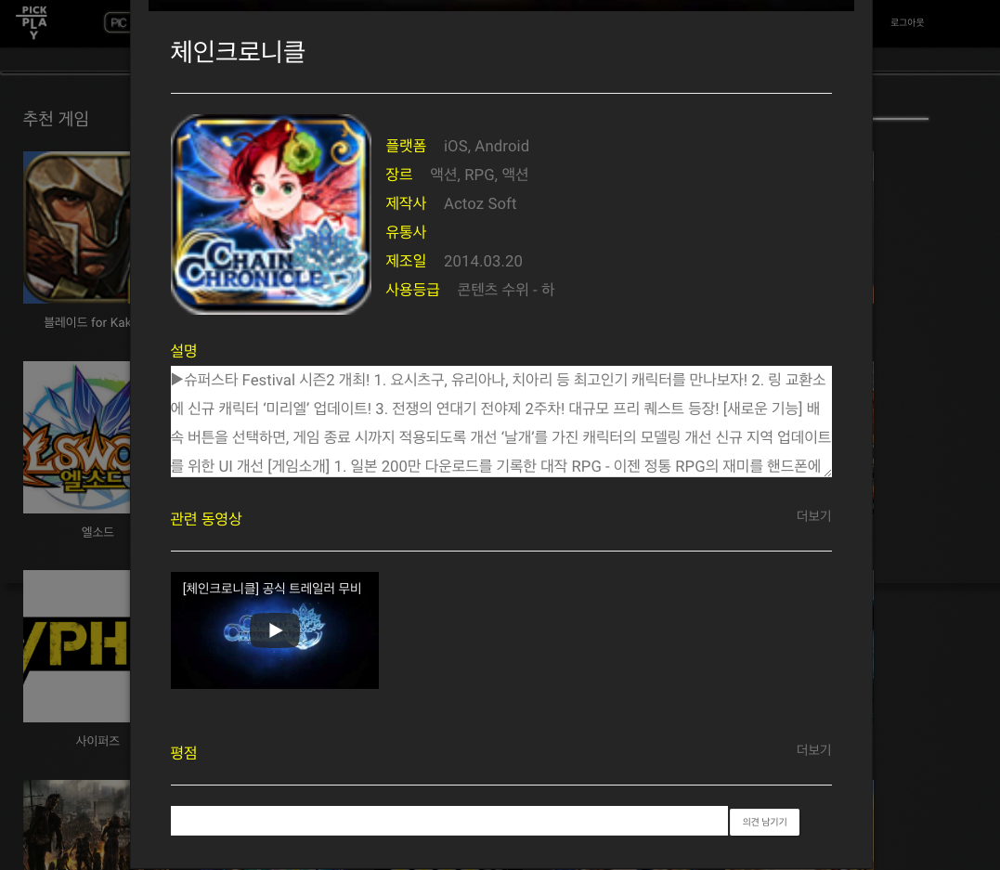

# 게임 추천 서비스 PickPlay

2014년 단국대 해커톤에서 개발한 게임 추천 서비스입니다.

동작 영상 - *시연 영상.mov*에서 확인할 수 있습니다. 

### 실행 방법
**Ruby on Rails 개발 환경에서 동작합니다.**

이미 있는 데이터를 활용하기 위해서는 seed 파일을 추가해주세요.

`rake db:migrate && rake db:seed`

서버 동작

`rails s`

### 서비스 스크린샷

